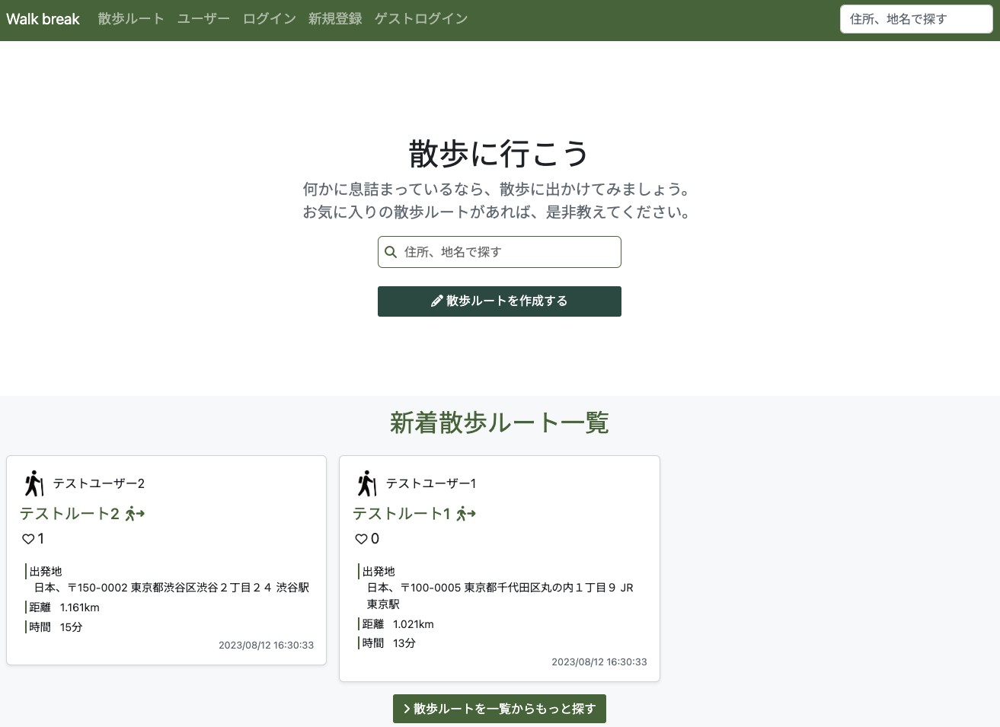
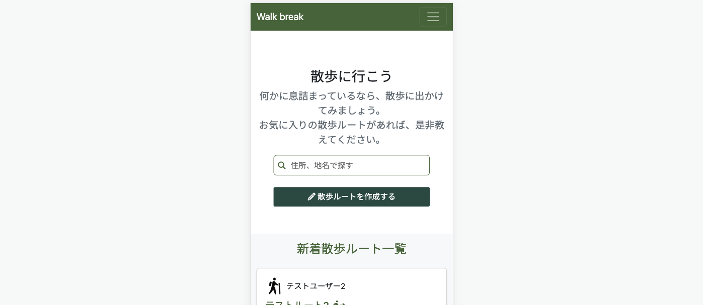
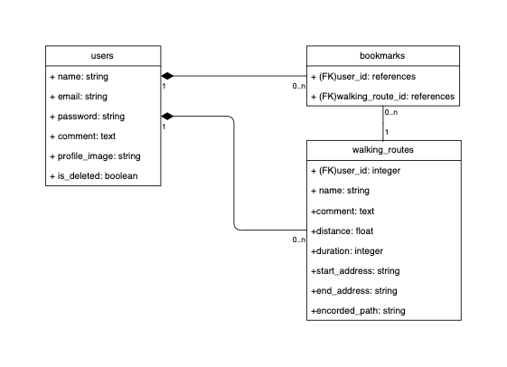

# Walk break
[Walk break](https://walkbreak-11323cd54fcf.herokuapp.com/)は、散歩ルートの作成・共有ができるアプリです。

- 散歩ルートはドラッグ&ドロップで詳細に編集可能です
- 作成された散歩ルートは検索やソート機能によって探索可能です
- レスポンシブ対応済みのため、スマートフォンでもご利用可能です

## 目次
1. About
2. 使用技術
3. UMLクラス図
4. 機能、テスト一覧
5. 今後追加したい機能

## 1. About
#背景や思いなど

## 2. 使用技術
- HTML/CSS/JavaScript
- Bootstrap 5.2.3
- Ruby 2.7.6
- Ruby on rails 7.0.4.3
  - RSpec
  - SQLite 3.39.5
- Google Maps API
- AWS S3
- Heroku
  - Postgres 15.4

## 3. UMLクラス図

## 4. 機能、テスト一覧
- ユーザー関連
  - ユーザー登録、ログイン(devise)
  - 論理削除での退会
  - プロフィール作成
    - プロフィール画像アップロード(CarrierWave)
    - 作成済み散歩ルート一覧表示
    - ブックマーク一覧表示
  - ユーザー一覧表示
  - ユーザー名検索
  - ゲストログイン

- 散歩ルート関連(Maps JavaScript API)
  - 散歩ルート作成(Directions API)
  - 散歩ルート表示(geometryライブラリ)
  - 散歩ルート一覧表示
  - 散歩ルートソート(作成日時・ブックマーク数・距離・時間)
  - 住所・地名でのルート検索

- ブックマーク関連
  - ブックマークの追加・削除
  - 散歩ルートごとのブックマーク数表示

- テスト
  - RSpec
    - 単体テスト(spec/models)
    - 機能テスト(spec/requests)
    - 統合テスト(spec/system)

## 5. 今後追加したい機能
### 消費カロリー計算機能
- [ ] 散歩ルートの消費カロリー計算（ユーザーの体重とルートの距離を使用）
- [ ] ユーザーごとの総消費カロリーランキング作成（ex.総距離）
- [ ] ユーザーごとに実際に歩いた散歩ルート履歴の作成

### 検索バリエーションの追加
- [ ] 散歩ルートにタグ付け（例：緑が多い道）し、タグ情報で検索
- [ ] スマートフォンでの利用時、現在の位置情報から周辺の散歩ルートを検索

### その他ユーザー関連
- [ ] 管理ユーザー機能（退会ユーザーの復元）
- [ ] フォロー/フォロワー機能
- [ ] 散歩ルートページ上でブックマークしたユーザー一覧を表示
